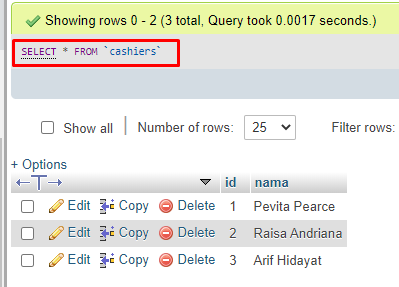
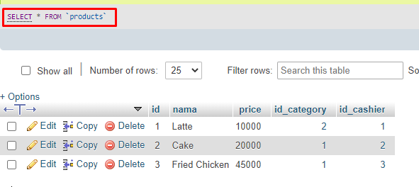
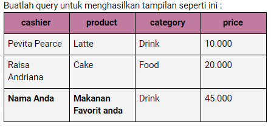
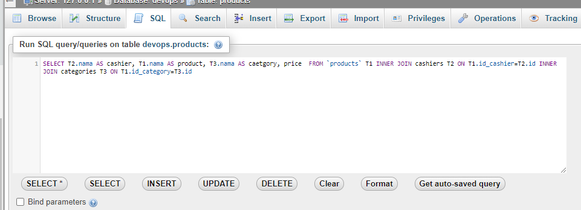
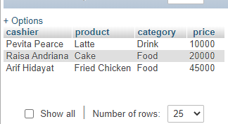

Tabel Cashiers

Tabel Categories

Tabel Products

Soal

Hasil :
Query yang digunakan 
"SELECT T2.nama AS cashier, T1.nama AS product, T3.nama AS caetgory, price  FROM `products` T1 INNER JOIN cashiers T2 ON T1.id_cashier=T2.id INNER JOIN categories T3 ON T1.id_category=T3.id"

Output dari Query :

