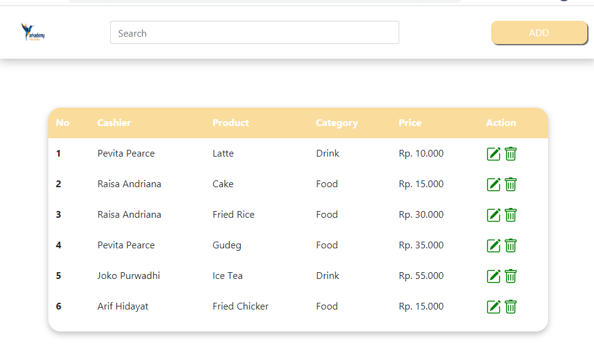
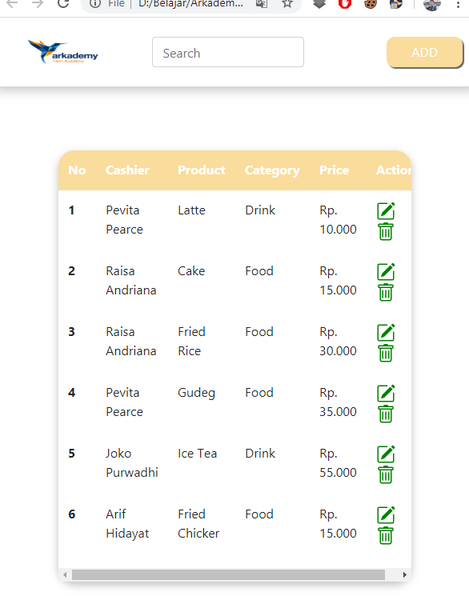
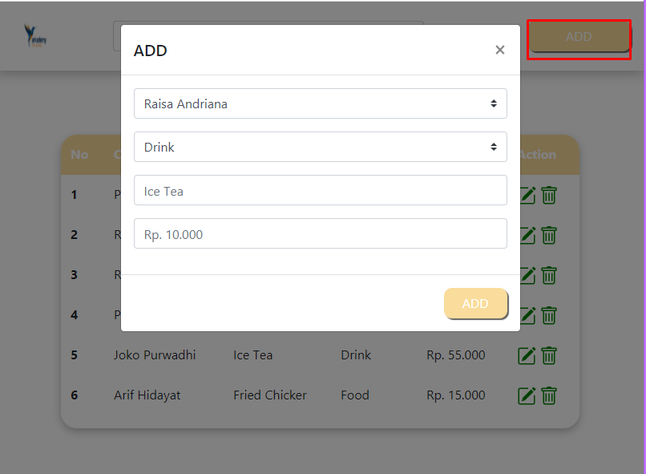
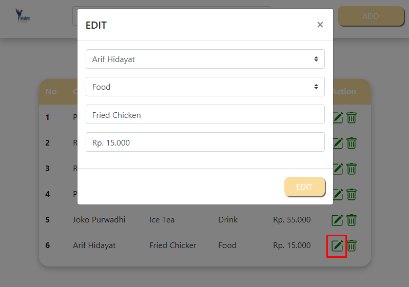
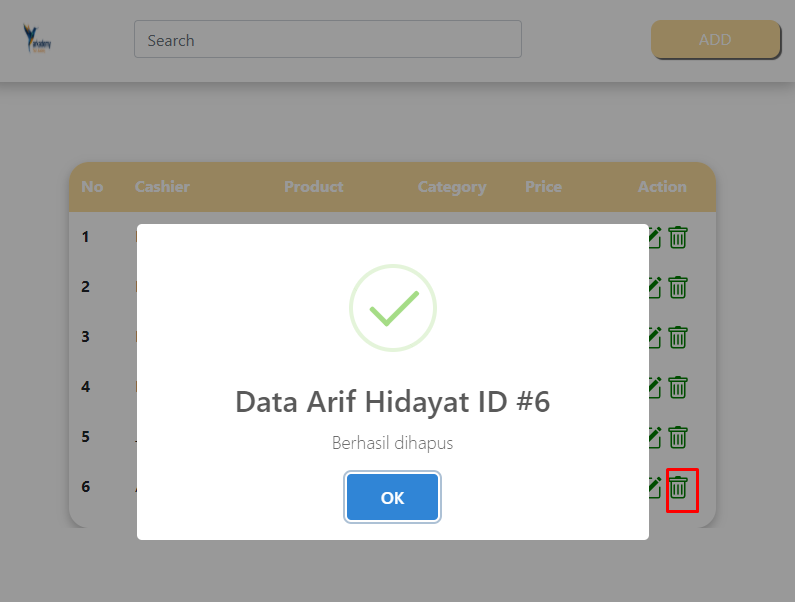

Soal 3b
Buatlah sebuah tampilan Website sesuai dengan mockup di figma https://www.figma.com/file/IHRk44f4aM8C2KXIvPNnoa/POS-App-Test-(Copy) menggunakan data statik dengan HTML, CSS, dan JS. Boleh menggunakan Bootstrap, Material UI, atau yang lainnya. HARUS DIPISAH (BERBEDA FILE/FOLDER) DENGAN NOMOR 6.C DAN SERTAKAN SCREENSHOT!

Hasil :
Tampilan Halaman utama menggunakan browser full layar

Tampilan menggunakan browser dengan memperkecil window browser, hasilnya responsive

Tampilan fitur menambahkan data

Tampilan mengedit salah satu data pada tabel, menggunakan javascript agar ketika tombol edit pada baris tabel diklik otomatis menambilkan data edit sesuai baris

Tampilan alert hapus, pesan notifikasi sesuai data pada baris menggunakan javascript

