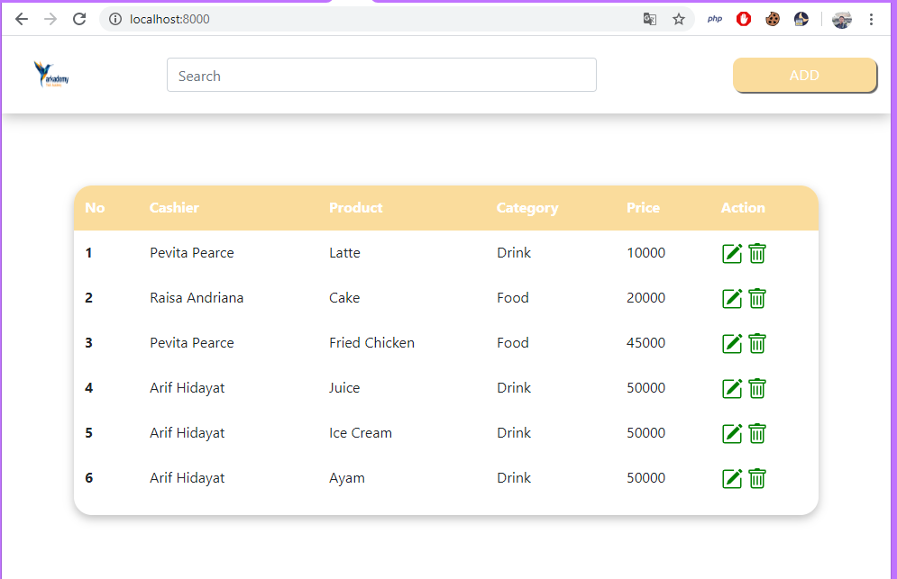
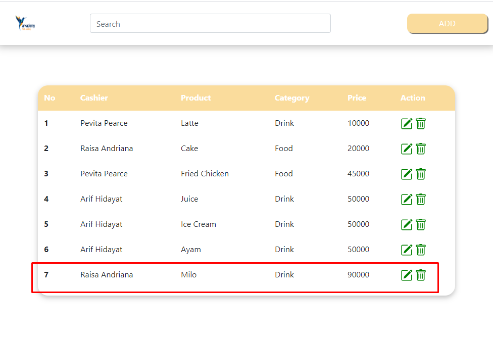

Buatlah sebuah tampilan Website sesuai dengan mockup di figma pada point 6.B menggunakan data dinamis yang berasal dari point 6.A  serta ditambahkan fitur CRUD ke database pada point 6.A. SERTAKAN SCREENSHOT!

Cara menjalankan yaitu
copy file .env.example menjadi .env
isikan database user, password, db

ketikkan "composer install"
ketikkan "php artisan key:generate"
ketikkan "php artisan migrate"
ketikkan "php artisan serve"

Hasil :
Tampilan utama
Fitur Read data

Fitur Penambahan data

Data berhasil ditambahkan

Fitur melakukan pengubahan data

